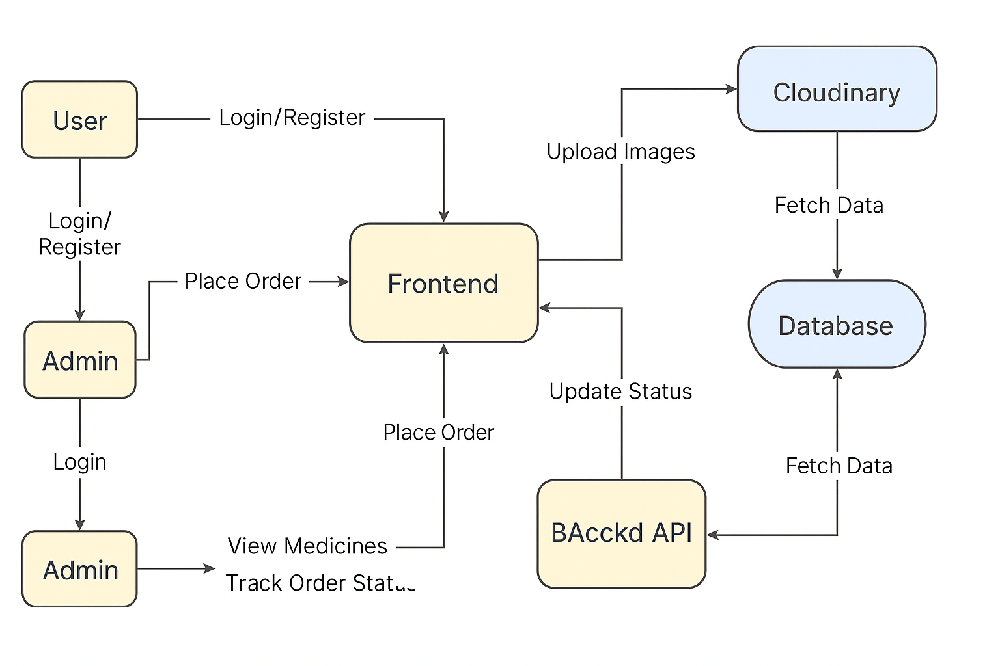

<h1>💊 MedicinePlace — Full‑fledged Medicine Booking & Delivery App</h1>

Modern full‑stack e-commerce platform for booking, approving, and delivering medicines. 
Built with Node.js, Express, Next.js, Kysely, and Cloudinary.

<h2>📌 About the Project</h2>

MedicinePlace is a complete end-to-end system for:

<ul>
  <li>🧾 Browsing and ordering medicines</li>
  <li>🔒 Secure user login & JWT authentication</li>
  <li>✅ Admin approval flow for placed orders</li>
  <li>🚚 Delivery tracking until the order reaches the customer</li>
  <li>📦 Cloud storage for product images</li>
  <li>💳 Payment (planned / optional integration)</li>
</ul>

Ideal as a freelance medicine delivery app, a portfolio project, or a real e-commerce product foundation.

<h2>🛠 Tech Stack</h2>

<table>
  <thead>
    <tr>
      <th>Layer</th>
      <th>Technology</th>
    </tr>
  </thead>
  <tbody>
    <tr>
      <td>Frontend</td>
      <td>Next.js, React, Tailwind CSS</td>
    </tr>
    <tr>
      <td>Backend</td>
      <td>Node.js, Express</td>
    </tr>
    <tr>
      <td>Database</td>
      <td>PostgreSQL with Kysely + kysely-codegen</td>
    </tr>
    <tr>
      <td>Auth</td>
      <td>JWT</td>
    </tr>
    <tr>
      <td>Media</td>
      <td>Cloudinary</td>
    </tr>
  </tbody>
</table>

<h2>🌟 Key Features</h2>

<ul>
  <li>✅ Fully responsive website for browsing & booking medicines</li>
  <li>✅ Place an order → admin approves → order processed → delivered to customer</li>
  <li>✅ Cloudinary image upload</li>
  <li>✅ JWT-protected admin & user routes</li>
  <li>✅ Kysely query builder with auto‑generated types</li>
  <li>✅ Delivery tracking (status updates like Pending → Approved → Out for Delivery → Delivered)</li>
</ul>

<h2>🧩 System Flow Diagram</h2>

<h2>🚀 Getting Started</h2>

<h3>1️⃣ Clone the Repository</h3>

<pre><code>git clone https://github.com/yourusername/medicineplace.git
cd medicineplace
</code></pre>

<h3>2️⃣ Backend Setup</h3>

<pre><code>cd backend
npm install
</code></pre>

Create <code>.env</code> file in <code>backend</code> folder with:

<pre><code>PORT=5000
JWT_SECRET=your_jwt_secret
CLOUDINARY_CLOUD_NAME=your_cloud_name
CLOUDINARY_API_KEY=your_api_key
CLOUDINARY_API_SECRET=your_api_secret
DATABASE_URL=your_postgres_url
</code></pre>

<pre><code>npm run db:generate
npm run migrate
npm run seed
npm run dev
</code></pre>

<h3>3️⃣ Frontend Setup</h3>

<pre><code>cd ../frontend
npm install
</code></pre>

Create <code>.env.local</code> file in <code>frontend</code> folder with:

<pre><code>NEXT_PUBLIC_API_BASE_URL=http://localhost:5000/api
</code></pre>

<pre><code>npm run dev
</code></pre>

Open your browser at <a href="http://localhost:3000">http://localhost:3000</a>

<h2>📸 Image Uploads</h2>

Product images upload to Cloudinary automatically. 
Set your Cloudinary credentials in backend <code>.env</code>.

<h2>📦 Database Tool</h2>

<ul>
  <li>Type-safe queries</li>
  <li>Auto‑generated DB types</li>
  <li>Easy migration and maintenance</li>
</ul>

<h2>🛡 Authentication</h2>

<ul>
  <li>JWT-based login</li>
  <li>Token in Authorization header</li>
  <li>Frontend handles login & token storage</li>
</ul>

<h2>🐞 Troubleshooting</h2>

<ul>
  <li>Product upload fails? → check Cloudinary <code>.env</code></li>
  <li>CORS errors? → check <code>NEXT_PUBLIC_API_BASE_URL</code></li>
</ul>

<h2>🧰 Scripts Reference</h2>

<table>
  <thead>
    <tr>
      <th>Command</th>
      <th>Location</th>
      <th>Description</th>
    </tr>
  </thead>
  <tbody>
    <tr>
      <td>npm run dev</td>
      <td>backend</td>
      <td>Start backend in dev mode</td>
    </tr>
    <tr>
      <td>npm run migrate</td>
      <td>backend</td>
      <td>Run DB migrations</td>
    </tr>
    <tr>
      <td>npm run seed</td>
      <td>backend</td>
      <td>Seed admin & test users</td>
    </tr>
    <tr>
      <td>npm run db:generate</td>
      <td>backend</td>
      <td>Generate Kysely DB types</td>
    </tr>
    <tr>
      <td>npm run dev</td>
      <td>frontend</td>
      <td>Start frontend in dev mode</td>
    </tr>
  </tbody>
</table>

